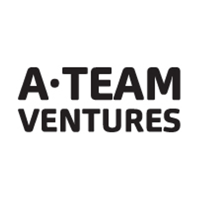
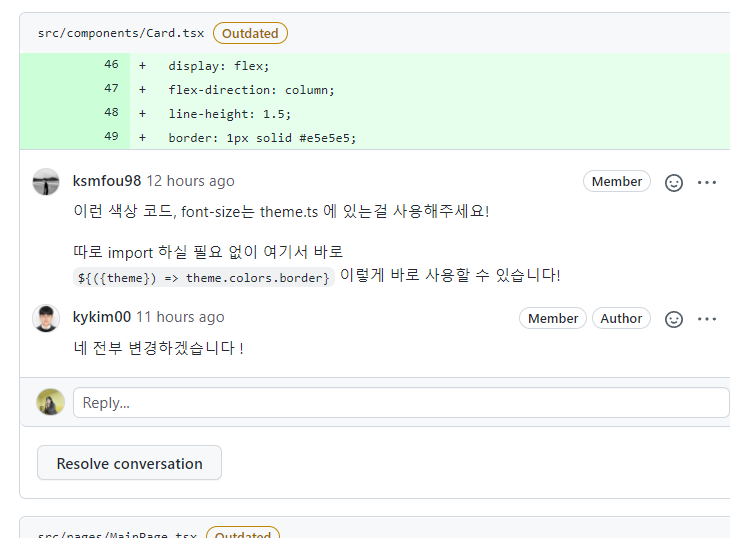
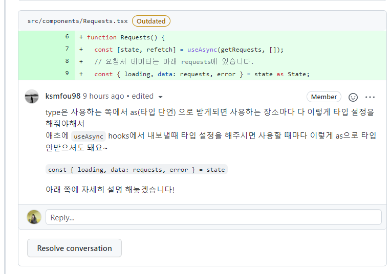
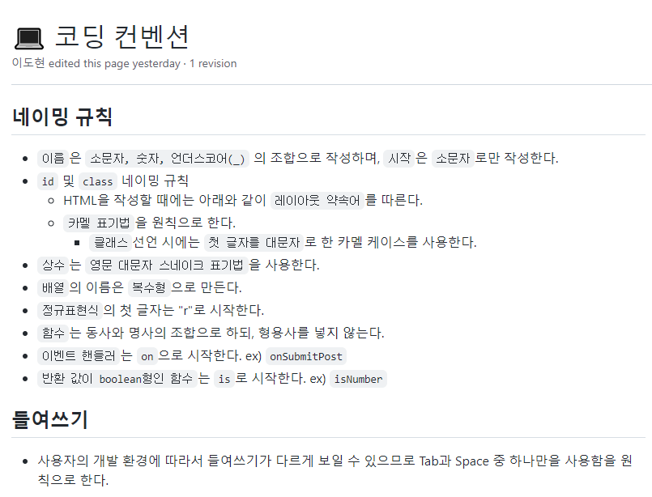
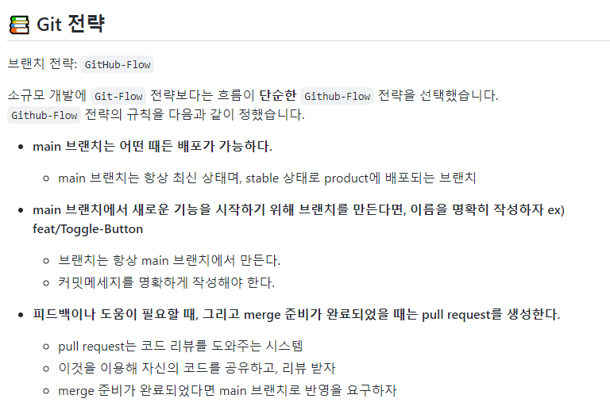
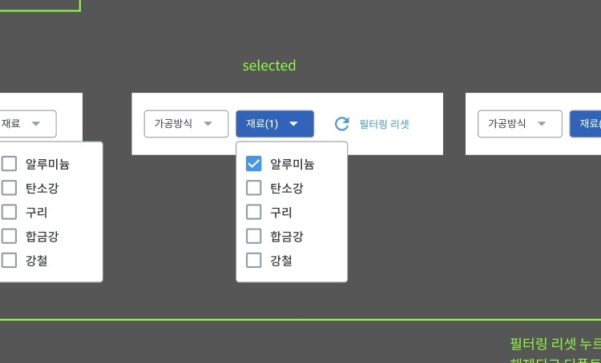
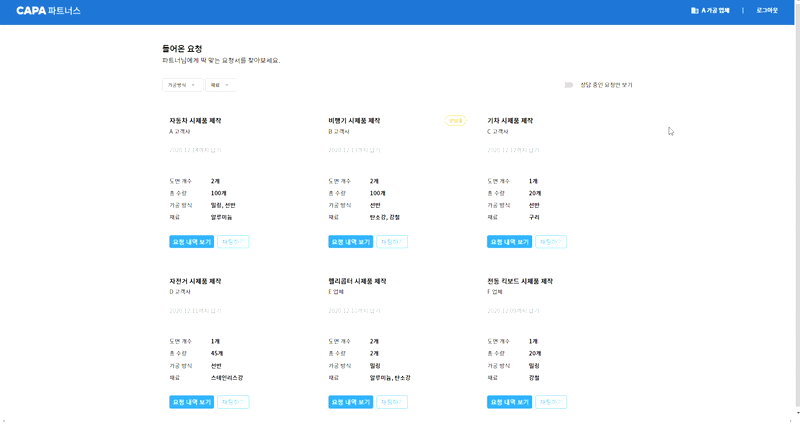

# 📝 원티드 프리 온보딩 2주차 과제 - 견적 요청 페이지

## 에이팀벤처스 - 견적 요청 페이지 구현



## 📌배포 링크

- [배포링크](https://requestquote.herokuapp.com/)

## 📌프로젝트 소개

- 에이팀벤처스의 파트너스 견적 요청을 확인하는 페이지 구현

- mock data를 json server로 연동 및 배포

- 공용 컴포넌트 사용을 통한 코드 재사용성과 작업 효율성 향상

## 📌팀원 소개

<table align="center">
<tr >
<td align="center"><a href="https://github.com/perfumelim"></a></td>
<td align="center"><a href="https://github.com/kykim00"></a></td>
<td align="center"><a href="https://github.com/ksmfou98"></a></td>
<td align="center"><a href="https://github.com/yezyvibe"></a></td>
</tr>
<tr>
<td align="center"><b> 임향수 (팀장)</b></td>
<td align="center"><b>김기영</b></td>
<td align="center"><b>이도현</b></td>
<td align="center"><b>조예지</b></td>
</tr>
<tr>
<td align="center"><b>FE Developer</b></td>
<td align="center"><b>FE Developer</b></td>
<td align="center"><b>FE Developer</b></td>
<td align="center"><b>FE Developer</b></td>
</tr>
</table>

## 📌프로젝트 과정 소개

|                   🦸‍♂️팀원 간 코드 리뷰를 통한 소통🦸‍♀️                   |                   🦸‍♂️팀원 간 코드 리뷰를 통한 소통🦸‍♀️                   |
| :-------------------------------------------------------------------: | :-------------------------------------------------------------------: |
|  |  |

|                                         코딩 컨벤션 약속을 통한 코드 통일성                                         |                                                Git 커밋 컨벤션 정의                                                 |
| :-----------------------------------------------------------------------------------------------------------------: | :-----------------------------------------------------------------------------------------------------------------: |
|  |  |

## 📌기능 목록 명세

### ✔ 담당자 : 김기영

- `공용 컴포넌트` 버튼, 토글 구현
  - width, height props를 입력 받아서 크기 조절 가능 -> 재사용성 증가
- 견적 요청 카드 컴포넌트 구현
- 대시보드 구현

### ✔ 담당자 : 이도현

- 반응형 디자인을 위한 `Media query` 세팅 및 breakPoint 상수화
- 선택한 가공방식과 재료 선택에 따른 견적 요청 `필터링 기능` 구현
- json server와 함께 배포하기 위한 `배포 환경 설정`

### ✔ 담당자 : 임향수

- color, font-size 등 전역적인 스타일링에 활용할 `theme과 global style` 구현

- 상단 헤더 구현

- 사이드메뉴 구현

  - 헤더의 hamburger 버튼 클릭시 사이드메뉴가 열리도록 설정
  - 백그라운드 영역 클릭시 메뉴가 닫히도록 설정

### ✔ 담당자 : 조예지

- `json server `셋팅
- 비동기 데이터 처리를 위한 재사용 가능 커스텀 hooks 구현
- 조건에 일치하는 견적서 없는 경우 조건 처리 -> 페이지 구현

## 📌구현 기능 미리 보기

### 1. 필터 기능 👉 가공 방식과 재료 옵션을 제한 없이 중복 선택 가능 하도록 구현

- figma 상세 이미지를 참고하여 옵션이 1개 이상 선택 가능한 것으로 판단하여 -> 중복 선택 가능하게 필터링함
- 중복 선택할 경우 사용자 경험을 고려하여 체크 된 조건을 모두 만족하는 요청서를 보여주도록 구현



### 2. 반응형 페이지 구현 👉 데스크 / 태블릿/ 모바일 사이즈에 따라 페이지 변화

- Media query 사용



## 📌프로젝트 설치 및 시작

### 프로젝트 클론

```
$ git clone https://github.com/2201infinity/request_a_quote.git
```

### 패키지 설치

```
$ yarn
```

### 서버 실행

```
$ yarn run dev
```
